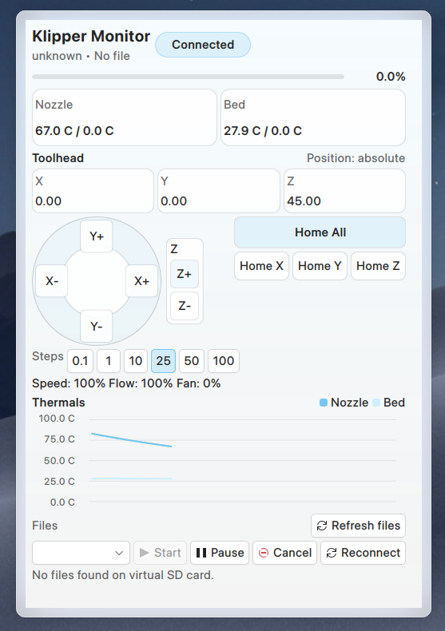
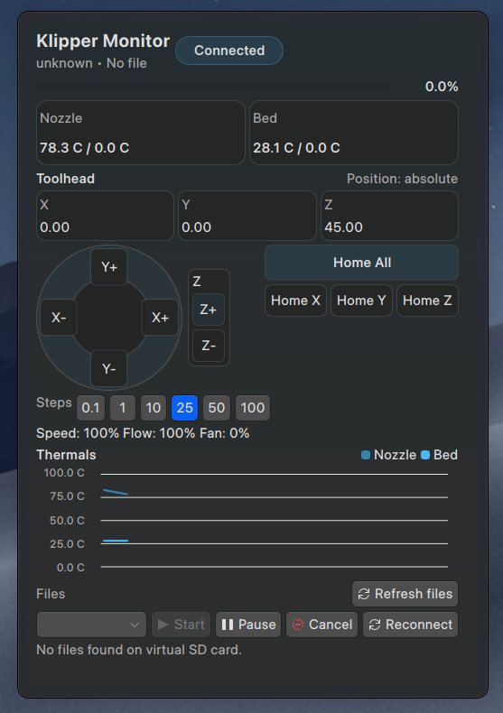

<!-- SPDX-FileCopyrightText: 2025 Marco Gaib - mgdev72@gmail.com -->
<!-- SPDX-License-Identifier: GPL-3.0-or-later -->
# Klipper Monitor Plasmoid

Plasma 6 plasmoid to monitor and control a Klipper printer via the Moonraker WebSocket API.
Includes live temperatures, motion data, a themed jog pad, homing controls, and
virtual SD card file selection.

## Screenshots

Light theme:



Dark theme:



## Install (local dev)

```bash
kpackagetool6 --type Plasma/Applet --install .
```

If already installed:

```bash
kpackagetool6 --type Plasma/Applet --upgrade .
```

Reload plasmashell if needed:

```bash
plasmashell --replace
```

## Configure

Open the plasmoid configuration and set:
- Host and port (Moonraker default is 7125)
- TLS if needed
- WebSocket path (default: `/websocket`)
- API key/token (appended as `?token=` to the WebSocket URL)
- Chart interval (ms)
- Jog step (mm)
- Jog feedrate XY/Z (mm/min, 0 = Klipper default)
- Default file name to start prints

## Notes

- Status updates subscribe to `print_stats`, `virtual_sdcard`, `extruder`, `heater_bed`,
  `toolhead`, `gcode_move`, `fan`, and `motion_report` (live position).
- Charts are sampled on a timer; set the interval in settings for smoother or lighter updates.
- Controls call `printer.print.start/pause/resume/cancel`.
- Jog moves use absolute positioning (G90) and can optionally set feedrates per axis.
- If your Moonraker uses header-based API keys, you may need a reverse proxy that supports query-token auth.

## Features

- Live printer status, file, and progress.
- Temperature charts for nozzle and bed with dynamic scale.
- Toolhead panel with live position (X/Y/Z), speed, flow, and fan.
- Themed jog pad (absolute moves) and homing controls (All/X/Y/Z).
- Virtual SD card file picker with refresh.
- UI enable/disable toggle with visual dimming when paused.

## Usage

- Pick a file from the virtual SD list and press Start.
- Use the jog pad for XY moves and Z buttons for Z moves.
- Set jog step and (optional) feedrates in Settings.
- Use the Enabled switch to pause connections when the printer is offline.

## Localization

This plasmoid ships translations for German, French, Italian, Spanish, Dutch,
and Brazilian Portuguese. The translation domain is
`plasma_applet_org.kde.plasma.klippermonitor` and catalogs live under
`contents/locale/<lang>/LC_MESSAGES/`.
You can override the UI language in the settings; leave it on System language
to follow KDE’s locale settings.

To regenerate `.mo` files from the `po/` sources:

```bash
python3 scripts/compile_mo.py
```

To regenerate the runtime language override catalog:

```bash
python3 scripts/compile_i18n_js.py
```

## Troubleshooting

- No files listed: ensure Moonraker’s `server.files.list` is available and your
  client is authorized.
- No data: verify host/port, TLS, and token. Use a direct LAN address if possible.

## Changelog

See `CHANGELOG.md`.

## Release Labels

GitHub Release Notes are generated from labels. Recommended labels:

- `feature`, `enhancement`
- `bug`, `fix`
- `docs`
- `chore`, `refactor`, `build`, `ci`
- `skip-changelog` (excluded from notes)
